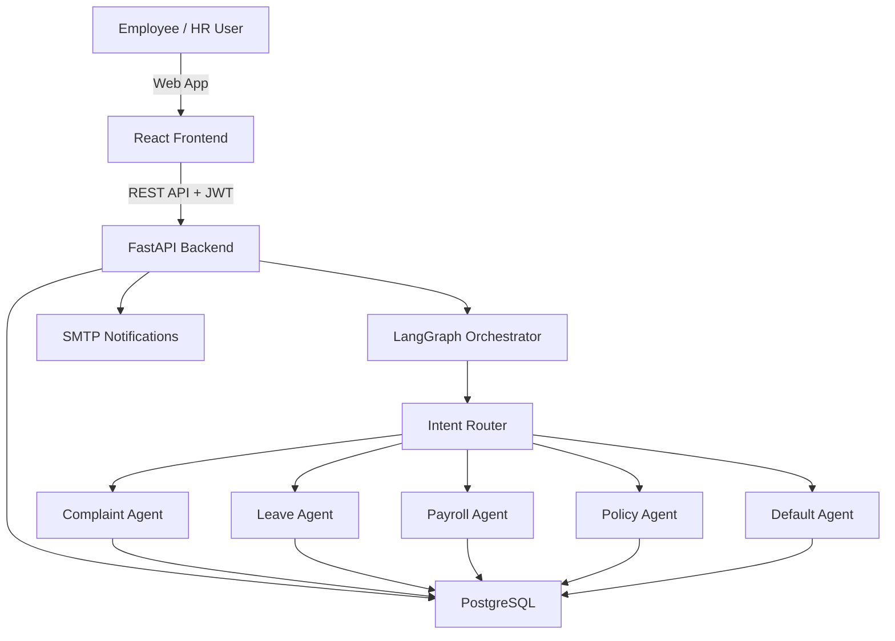
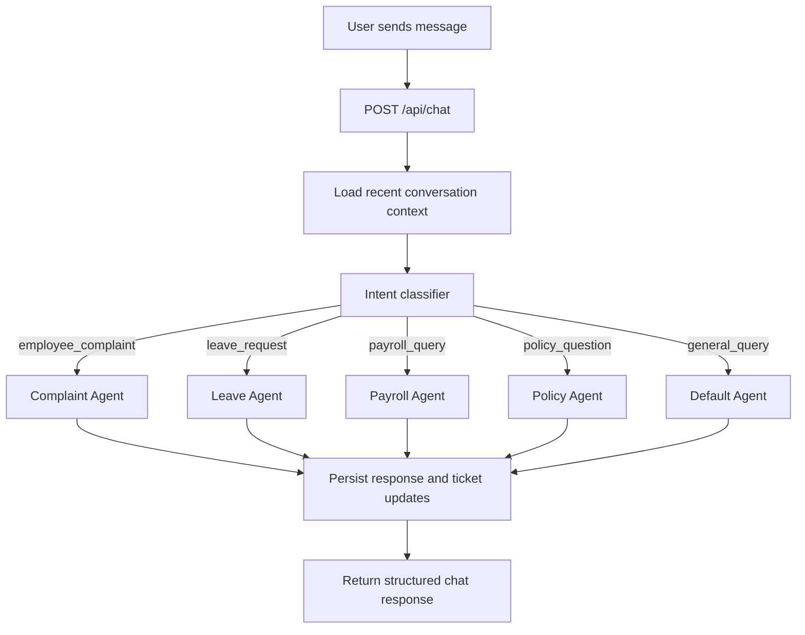
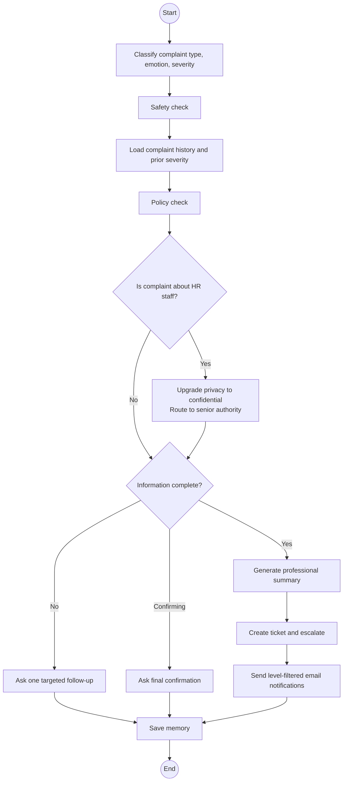
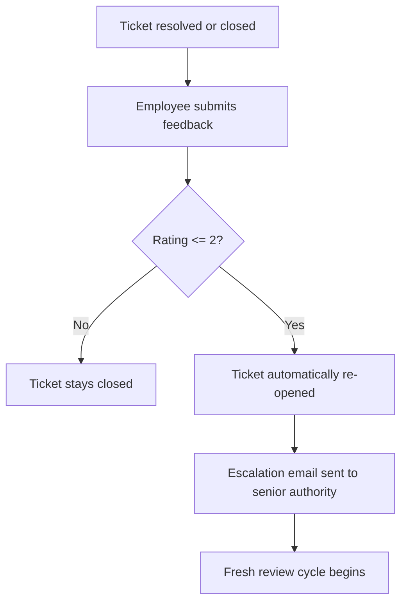

# PulseHR AI

Most HR tools were built for **HR teams**, not for the people who actually need help. An employee dealing with **workplace harassment**, a **payroll discrepancy**, or a **sensitive personal situation** doesn't want to fill out a form — they want to talk to someone. **PulseHR AI** is what happens when you take that instinct seriously and build a system from the ground up around it.

---

## What Is PulseHR AI?

PulseHR AI is a **full-stack AI operations platform** that lets employees describe problems in **plain language** and then does the hard work of **understanding, classifying, escalating, and tracking** those problems inside a structured HR workflow.

> **It is not a chatbot wrapper.** Under the hood it runs a **multi-agent LangGraph orchestration layer** that routes each employee message to the right specialist agent — complaint intake, leave management, payroll support, or policy lookup — depending on **real detected intent**. Each agent has its own logic, memory, and escalation rules. Everything that happens is **persisted, auditable, and visible** to the right people at the right time.

On the HR side, the platform gives teams a proper operational workspace: **ticket dashboards**, **SLA tracking**, **conversation history**, **analytics reports**, **user and policy management**, **internal messaging**, and a **level-wise notification system** so every person on the team only gets alerted for the severity levels they actually care about.

> **Nothing about this system is accidental.** Every feature in it exists because a real HR workflow demanded it.

---

## The Problem It Solves

Traditional HR tools break down in **exactly the moments that matter most**.

An employee who has been mistreated rarely knows which dropdown to select, which form to submit, or which department to contact. They know what happened to them. They can describe it. But the system asks them to **categorize it first**, and that friction alone **stops many people from ever reporting**.

On the HR side, the problem is the opposite. Teams are buried in **unstructured input** — emails, verbal reports, informal messages — that they have to manually triage, classify, and act on. **There is no single source of truth. SLAs slip. Complaints get lost.**

PulseHR AI **removes both bottlenecks at once**:

- employees describe problems **conversationally**, in any order, with **no forms**
- the backend **understands intent**, fills in missing context through **targeted follow-up questions**, and produces a **structured, actionable record**
- HR teams receive **organized ticket data**, email alerts **calibrated to what they actually want to hear about**, and a **full audit trail**

---

## How It Works — End to End

### The Employee Experience

An employee opens the chat interface and types whatever is on their mind. **The platform does not ask them to pick a category. It listens.**

A **LangGraph-powered intent classifier** reads the message in context and decides which specialist agent should take over. From that point the conversation feels natural — the agent asks exactly the follow-up questions needed to build a complete picture, confirms details before submitting, and then tells the employee what happens next.

For complaints specifically, the agent is designed to behave like a **trained HR intake specialist**. It **identifies the complaint type**, **assesses emotional tone**, **estimates severity**, **checks relevant policy**, and **determines whether safety-critical elements are present**. It remembers everything said earlier in the conversation so it **never asks the same question twice**. When enough information exists to act, it writes a **professional summary** and **escalates automatically**.

Employees can also check their **ticket status** at any time, see **past conversations**, **request leave**, **ask payroll questions**, or **query policies** — all from the same interface, without switching between tools.

After a ticket is resolved, employees are invited to leave **feedback**. If a review score is **low**, the system **automatically re-opens the ticket**, notifies senior authority, and begins a fresh escalation cycle. **Closed does not mean gone.**

### The Agent Layer

The orchestration layer runs five specialized agents:

**Complaint Agent** — the most sophisticated agent in the system. It runs a full intake pipeline: classify → safety check → policy check → determine information completeness → follow up or escalate. It handles multi-turn conversations with stateful memory, detects when a complaint involves an HR team member and automatically upgrades privacy and routes to senior authority, and generates structured summaries used to populate tickets.

**Leave Agent** — handles leave balance inquiries and leave request submissions. Validates requests against company policy and persists outcomes.

**Payroll Agent** — handles payroll discrepancy questions, salary queries, and deduction inquiries with contextual responses.

**Policy Agent** — answers questions grounded in the actual policy documents stored in the system. Responses are tied to stored content, not generated from general knowledge.

**Default Agent** — handles anything that does not clearly map to a specialist, providing helpful general HR guidance while staying in scope.

Every agent shares the **same orchestrator state structure** and writes back to the same **PostgreSQL store**, so **nothing is siloed**.

### The Escalation System

**Escalation is not an afterthought** — it is a **first-class part** of how the system works.

Severity levels drive notification behavior at every stage:

| Level      | What Happens                                                       |
| ---------- | ------------------------------------------------------------------ |
| `critical` | HR notified immediately, senior authority notified, ticket created |
| `high`     | HR notified, ticket created                                        |
| `medium`   | Ticket created                                                     |
| `low`      | Logged and tracked                                                 |

Crucially, each HR or authority user can **configure exactly which levels trigger their email notifications**. Someone who only wants to know about critical and high severity issues will **never see a medium or low notification**. This is managed through **per-user level controls** in the admin panel — not a system-wide switch but **granular per-person, per-level toggles**.

There is also a **separate escalation path for HR-targeted complaints**. When the complaint agent detects that the subject of a complaint is an **HR team member**, it automatically **upgrades the privacy mode to confidential** and routes all notifications **directly to senior authority**, bypassing the HR team entirely. That ticket **disappears from HR dashboards** and is only visible to **admin-level users**.

### The HR Workspace

The admin and HR interface is a **full operational platform**, not a read-only view.

**Dashboard** — real-time ticket counts by status, severity distribution, SLA health, and resolution trends. Designed to give a shift supervisor an instant picture of what needs attention.

**Ticket Management** — full ticket lifecycle from creation to resolution. HR can add comments, reassign tickets, change status, and view the full AI-generated summary. Tickets with HR-targeted complaints are automatically hidden from HR users and surfaced only to senior authority.

**Conversation Viewer** — every AI-user conversation is stored and accessible. HR can review full chat history. Privacy-sensitive conversations are gated by mode: `identified` conversations are visible to HR, `confidential` ones are hidden from HR entirely and only accessible to admins.

**Reports** — analytics dashboard covering ticket volume over time, resolution rates, severity breakdowns, agent performance metrics, and conversation statistics. Built with Recharts for clear visual output.

**User Management** — create, update, and deactivate users across three roles: employee, HR admin, and senior authority. Each user's notification preferences, including per-severity-level email settings, are managed here.

**Policy Management** — HR can create, edit, and delete company policies that the policy agent uses to answer employee questions. Policies can also be seeded in bulk.

**Notification Management** — per-user, per-level email notification controls. Admins set which severity levels (critical, high, medium, low) each HR or authority user receives alerts for. Changes take effect immediately and filter at the point of sending.

**Agent Management** — senior authority can activate or deactivate individual agents. Deactivated agents fall back gracefully to the default handler.

**Internal Messaging** — HR and senior authority can exchange internal messages through the platform, keeping sensitive operational communication in one place.

---

## Privacy Architecture

Privacy is handled at the **conversation level**, not just the ticket level. Each conversation has a **privacy mode**:

- **Identified** — the reporter's identity is known and visible to HR
- **Confidential** — the conversation exists and a ticket is created, but **HR cannot see it**, cannot see the user in conversation lists, and cannot access ticket details; **only admins can**
- **Anonymous** — the reporter's identity is withheld from **all non-admin views**

**Privacy mode upgrades happen automatically** when the complaint agent detects conditions that warrant protection — for example, when the complaint target is an **HR staff member**.

---

## Tech Stack

### Frontend

| Layer         | Technology                |
| ------------- | ------------------------- |
| Framework     | React 19 + TypeScript     |
| Build tool    | Vite                      |
| Routing       | React Router              |
| Styling       | Tailwind CSS v4           |
| Data fetching | TanStack Query v5 + Axios |
| Charts        | Recharts                  |

### Backend

| Layer               | Technology                   |
| ------------------- | ---------------------------- |
| API framework       | FastAPI                      |
| Language            | Python 3.11+                 |
| Agent orchestration | LangGraph + LangChain        |
| Database ORM        | SQLAlchemy                   |
| Validation          | Pydantic / pydantic-settings |
| Auth                | JWT                          |
| Email               | SMTP                         |

### AI

| Component             | Detail                                      |
| --------------------- | ------------------------------------------- |
| LLM                   | NVIDIA AI Endpoints                         |
| Intent classification | LLM-based structured output                 |
| Agent memory          | PostgreSQL-backed stateful store            |
| Complaint flow        | Multi-node LangGraph with conditional edges |

### Infrastructure

- PostgreSQL (hosted on Render)
- FastAPI backend (Render Web Service)
- React frontend (Render Static Site)

---

## System Architecture



---

## Agent Flows

### Message Routing



### Complaint Agent — Full Pipeline



### What the Complaint Agent Collects

Before escalating, the agent ensures it has:

- **what happened**, described in the employee's own words
- **when** it happened
- **who was involved**, including the target of the complaint
- whether there were **witnesses or supporting evidence**
- how the situation **affected the employee** personally or professionally

**It asks one follow-up question at a time. It never asks the same thing twice. It confirms the full summary before submitting.**

### Post-Resolution Feedback Loop



---

## Repository Structure

```text
.
├── frontend/                  # React + TypeScript client
│   ├── src/
│   │   ├── api/               # Axios client and API service wrappers
│   │   ├── components/        # Shared UI, layout, badges, skeletons
│   │   ├── contexts/          # Auth and session context
│   │   ├── hooks/             # TanStack Query data hooks
│   │   └── pages/             # Employee, HR, and admin screens
│
├── hr-ai-platform/            # FastAPI backend
│   ├── agents/                # Agent implementations and prompts
│   │   ├── complaint/         # Complaint agent — graph, tools, escalation, prompts
│   │   ├── leave/             # Leave agent
│   │   ├── payroll/           # Payroll agent
│   │   └── policy/            # Policy agent
│   ├── api/                   # REST route handlers and schemas
│   ├── app/                   # FastAPI bootstrap, config, auth, middleware
│   ├── db/                    # SQLAlchemy models and connection
│   ├── memory/                # Conversation memory store
│   ├── orchestrator/          # Shared state definitions
│   ├── escalation/            # Ticketing logic, SLA, notifier
│   └── utils/                 # Logging, privacy utilities
│
└── start.sh                   # Local development helper
```

---

## API Surface

```
POST   /api/auth/login
POST   /api/auth/logout

POST   /api/chat

GET    /api/users
POST   /api/users
PATCH  /api/users/{id}
DELETE /api/users/{id}

GET    /api/tickets
GET    /api/tickets/{id}
PATCH  /api/tickets/{id}
POST   /api/tickets/{id}/comments

GET    /api/conversations
GET    /api/conversations/{id}

GET    /api/reports/...

GET    /api/notifications
PATCH  /api/notifications/{user_id}

GET    /api/agents
PATCH  /api/agents/{id}

GET    /api/my/tickets
GET    /api/my/conversations

POST   /api/feedback

GET    /api/policies
POST   /api/policies
PATCH  /api/policies/{id}
DELETE /api/policies/{id}

GET    /api/messages
POST   /api/messages

GET    /health
```

---

## Local Development

### Prerequisites

- Python 3.11+
- Node.js 18+
- PostgreSQL

### Backend

```bash
cd hr-ai-platform
python3 -m venv .venv
source .venv/bin/activate
pip install -r requirements.txt
uvicorn app.main:app --host 0.0.0.0 --port 8000 --reload
```

Backend available at `http://localhost:8000`

### Frontend

```bash
cd frontend
npm install
npm run dev
```

Frontend available at `http://localhost:5173`

### Run Both at Once

```bash
./start.sh
```

---

## Environment Variables

### Backend

| Variable            | Purpose                            |
| ------------------- | ---------------------------------- |
| `DATABASE_URL`      | PostgreSQL connection string       |
| `NVIDIA_API_KEY`    | API key for the LLM provider       |
| `MODEL_NAME`        | LLM model identifier               |
| `JWT_SECRET_KEY`    | Secret for signing JWT tokens      |
| `SMTP_HOST`         | SMTP server host                   |
| `SMTP_PORT`         | SMTP server port                   |
| `SMTP_USER`         | SMTP login username                |
| `SMTP_PASSWORD`     | SMTP login password                |
| `SMTP_FROM`         | Sender email address               |
| `SMTP_TO_HR`        | Fallback HR email recipient        |
| `SMTP_TO_AUTHORITY` | Fallback authority email recipient |
| `ADMIN_USERNAME`    | Seed admin login name              |
| `ADMIN_EMAIL`       | Seed admin email                   |
| `ADMIN_FULL_NAME`   | Seed admin display name            |
| `ADMIN_PASSWORD`    | Seed admin password                |
| `ADMIN_ROLE`        | Seed admin role                    |

### Frontend

| Variable            | Purpose                                |
| ------------------- | -------------------------------------- |
| `VITE_API_BASE_URL` | Backend base URL used by the React app |

See `frontend/.env.example` for a local template.

### First-Run Admin Seeding

On **first startup** against an empty database the backend creates **one admin account** using the configured admin environment variables. **Seeding is skipped** if an active admin already exists. Updating the seed variables later has **no effect** on an already-created account — change the password through the UI instead.

---

## Deployment on Render

The project runs as three services: a Postgres database, a Python web service for the backend, and a static site for the frontend.

### 1. Postgres Database

Create a Render Postgres instance. Use the internal connection URL as the `DATABASE_URL` for the backend service.

### 2. Backend Web Service

| Setting           | Value                                              |
| ----------------- | -------------------------------------------------- |
| Service type      | Web Service                                        |
| Runtime           | Python 3                                           |
| Root directory    | `hr-ai-platform`                                   |
| Build command     | `pip install -r requirements.txt`                  |
| Start command     | `uvicorn app.main:app --host 0.0.0.0 --port $PORT` |
| Health check path | `/health`                                          |

Set all backend environment variables in the service dashboard.

### 3. Frontend Static Site

| Setting           | Value                     |
| ----------------- | ------------------------- |
| Service type      | Static Site               |
| Root directory    | `frontend`                |
| Build command     | `npm ci && npm run build` |
| Publish directory | `dist`                    |

Set `VITE_API_BASE_URL` to your backend service URL.

---

## What Gets Built When You Deploy This

When this system is running, you get:

- a **conversational interface** where any employee can describe an HR issue in plain English and reliably receive help
- an **AI layer** that understands what kind of issue it is, asks the right follow-up questions, and produces a **structured record** — without any human triage required
- **automatic escalation paths** that respect privacy, role boundaries, and severity levels
- an **HR operations dashboard** that surfaces what matters without overwhelming teams with noise
- a **level-wise notification system** where each person on the HR team independently controls which severity alerts reach their inbox
- **full auditability** — every message, every agent decision, every ticket change is stored and accessible to the right people

The goal from the start was to build a system that **actually works in a real workplace**. One where an employee in a difficult situation gets a response that **feels human**, and where the HR team gets **data they can act on**.

> **That is what PulseHR AI is.**
