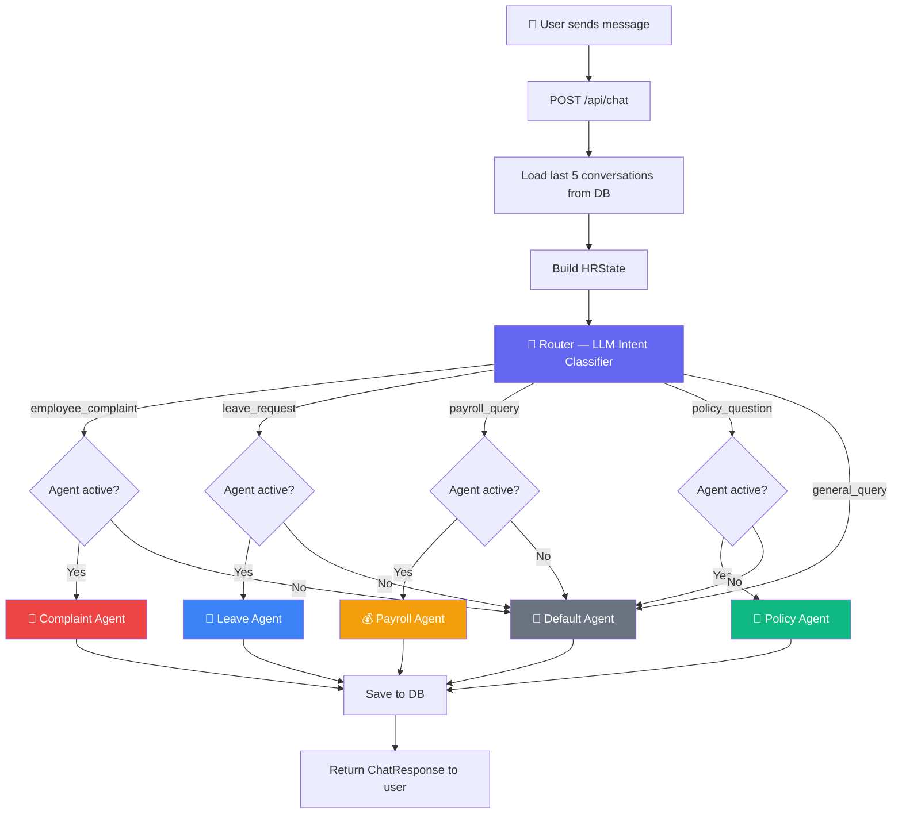
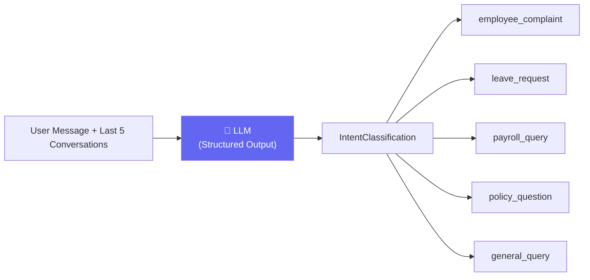
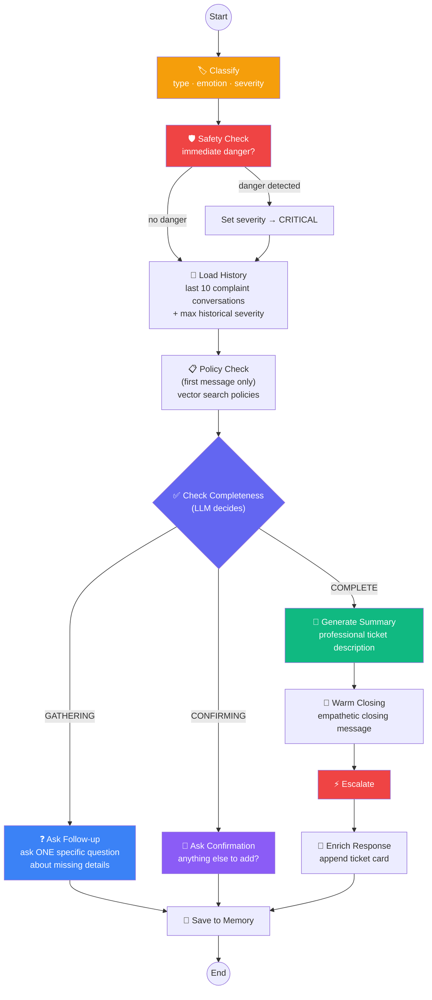
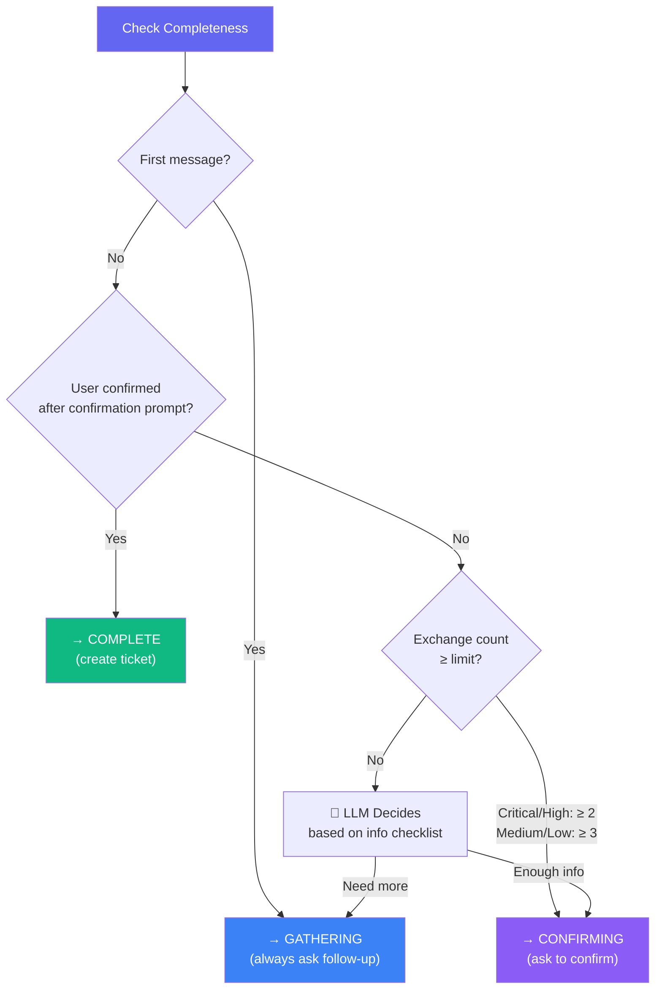
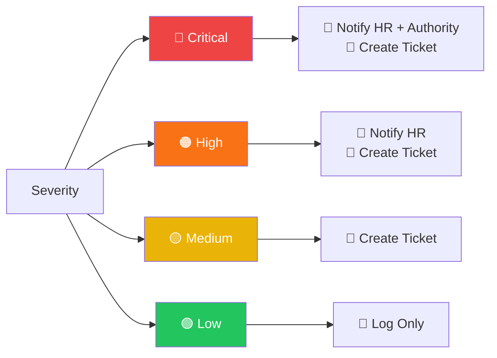
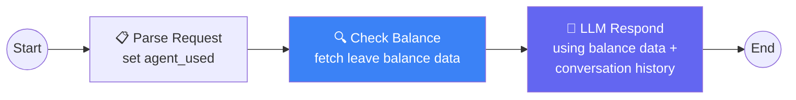
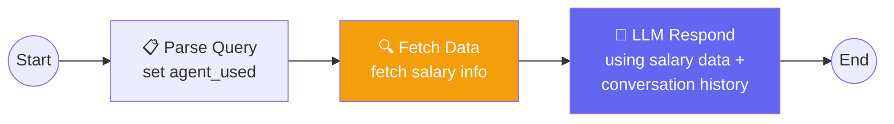
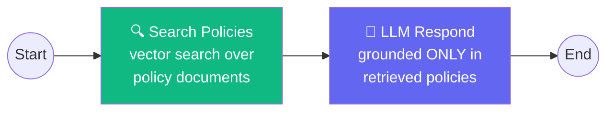
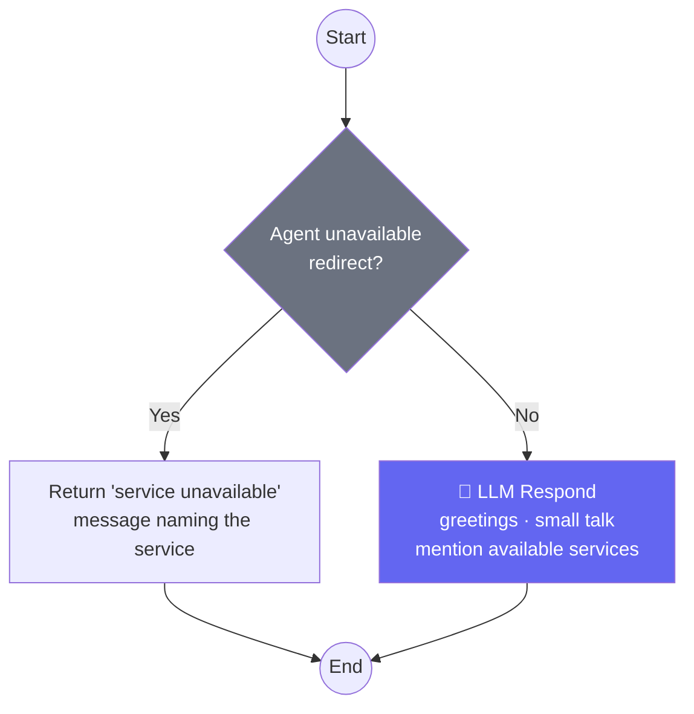
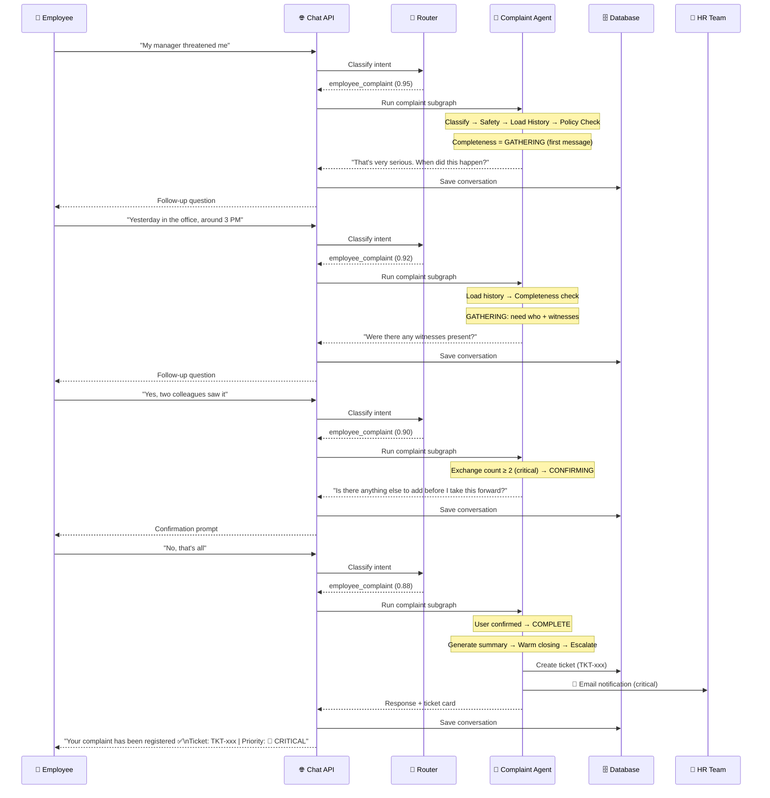

# PulseHR AI — Agent Flow Architecture

## 1. High-Level Orchestrator Flow

---

## 2. Intent Router (LLM Classification)

> The router includes conversation history so short follow-ups like "yes" / "no"
> during a complaint flow still classify as `employee_complaint`.

---

## 3. Complaint Agent — Multi-Turn Conversational Flow

This is the most complex agent. It asks follow-up questions like a real HR
assistant before creating a ticket.

### Completeness Decision Logic

### Info Checklist (what the agent gathers)

| #   | Detail                   | Example Question                          |
| --- | ------------------------ | ----------------------------------------- |
| 1   | **What happened**        | "Can you describe what exactly occurred?" |
| 2   | **When it happened**     | "When did this take place — date/time?"   |
| 3   | **Who was involved**     | "Who was the person involved?"            |
| 4   | **Witnesses / evidence** | "Were there any witnesses or evidence?"   |
| 5   | **Impact on employee**   | "How is this affecting your work?"        |

---

## 4. Escalation Rules

---

## 5. Leave Agent Flow

---

## 6. Payroll Agent Flow

---

## 7. Policy Agent Flow

> The policy agent **never makes up rules** — it only cites what's found in the
> actual policy documents.

---

## 8. Default Agent Flow

---

## 9. Complete End-to-End Example (Complaint)

---

## Architecture Summary

| Component           | Technology                    | Purpose                               |
| ------------------- | ----------------------------- | ------------------------------------- |
| **Orchestrator**    | LangGraph `StateGraph`        | Routes messages to the right agent    |
| **Router**          | LLM + Structured Output       | Intent classification (5 categories)  |
| **Dispatcher**      | Python function               | Agent activation check + routing      |
| **Complaint Agent** | LangGraph subgraph (12 nodes) | Multi-turn HR intake interview        |
| **Leave Agent**     | LangGraph subgraph (3 nodes)  | Leave balance lookup + response       |
| **Payroll Agent**   | LangGraph subgraph (3 nodes)  | Salary data lookup + response         |
| **Policy Agent**    | LangGraph subgraph (2 nodes)  | Vector search + grounded response     |
| **Default Agent**   | Inline LLM call               | Greetings + fallback                  |
| **Memory**          | PostgreSQL                    | Conversation + ticket persistence     |
| **Escalation**      | Rules engine + SMTP           | Ticket creation + email notifications |
